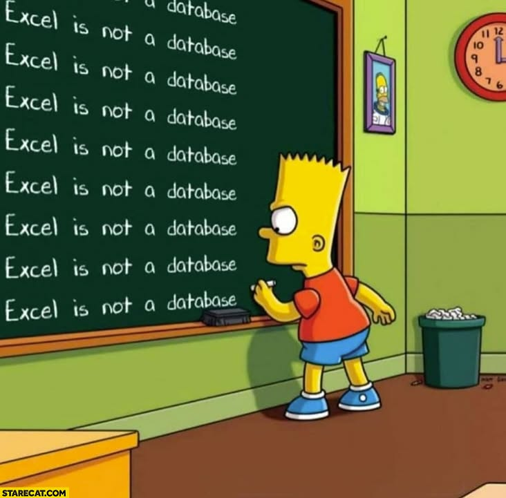

# CTI-CMM Mini App

Auteur : eric vanoverbeke
Date : 2026-01-18

Mini web-app Python + SQLite pour evaluer la maturite CTI/Risk.

## Excel n'est pas une base de donnees

Excel n'est pas une solution de base de donnees : il manque de fiabilite
transactionnelle, de controle d'acces et de gestion des verrous.



## CTI-CMM en bref

CTI-CMM signifie :

- Cyber Threat Intelligence Capability Maturity Model
- En francais : Modele de maturite des capacites en Cyber Threat Intelligence.

Definitions simples :

- Cyber Threat Intelligence (CTI) : discipline qui consiste a collecter, analyser et utiliser des informations sur les menaces (attaquants, techniques, campagnes) pour mieux se proteger et prendre de meilleures decisions.
- Capability : les capacites concretes d'une equipe CTI (ce qu'elle sait faire reellement).
- Maturity Model : un modele qui permet de situer ton niveau sur une echelle et de voir comment progresser.

CTI-CMM est donc un cadre (framework) qui decrit des pratiques CTI et permet
d'evaluer la maturite d'un programme CTI sur plusieurs domaines (le site
CTI-CMM parle de 11 domaines).

## Echelle CTI0 -> CTI3

Le tableur utilise une echelle en 4 niveaux :

- CTI0 : pas de capacite / pas en place
- CTI1 : partiellement en place
- CTI2 : largement en place
- CTI3 : totalement en place (pleinement operationnel)

## Statut

MVP en cours (v0.1). L'app demarre en Mode A.

## Modes cibles

- Mode A : Python + venv, localhost only (127.0.0.1)
- Mode B : binaire Windows via PyInstaller (buildable)
- Mode C : Docker, 0.0.0.0 dans le conteneur, volume `./data`

## Structure

- `app/` : backend Python (API + services + DB)
- `web/index.html` : UI monofichier (HTML/CSS/JS integres)
- `seed/` : referentiel initial (JSON)
- `data/` : persistance SQLite (`app.db`)
- `Dockerfile` : image Docker (Mode C)
- `docker/` : reserve pour compose / assets Docker
- `scripts/` : scripts de run/build
- `tests/` : tests minimaux

## Demarrer (Mode A)

```bash
python3 -m venv .venv
.venv/bin/python -m pip install -r requirements.txt
./scripts/run.sh
```

Ouvrir: http://127.0.0.1:9999/

## Demarrer (Mode C - Docker)

```bash
docker build -t cti-cmm .
docker run --rm -p 9999:9999 -v "$(pwd)/data:/app/data" cti-cmm
```

Ou via docker-compose:

```bash
docker compose up --build
```

### Mode C (Demo data-test)

```bash
docker build -t cti-cmm .
docker run --rm -p 9999:9999 -v "$(pwd)/data-test:/app/data" cti-cmm
```

Ou via docker-compose demo:

```bash
docker compose -f docker-compose.demo.yml up --build
```

## Construire (Mode B - EXE Windows)

Prerequis:

- Windows 10/11
- Python 3.11+
- pip (inclus avec Python)

Procedure (non testee ici):

```bash
python -m venv .venv
.venv\\Scripts\\python.exe -m pip install -r requirements.txt pyinstaller
pyinstaller --onefile --name cti-cmm app/main.py
```

Le binaire est genere dans `dist\\cti-cmm.exe`.

## Donnees de test

Pour lancer avec un jeu de donnees riche:

```bash
./scripts/run.sh --test-data
```

## Langue

Selecteur de langue dans l'UI (EN/FR). Le defaut serveur se regle via
`APP_DEFAULT_LANG` (valeurs: `en` ou `fr`).

## Documentation utilisateur

Voir `docs/user-guide.md`.

## Licence

AGPLv3 (voir `LICENSE`) et notice legale dans `docs/legal-notice.md`.

## Roadmap courte

Roadmap a definir.
